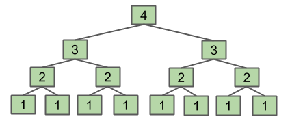

# CS 61B Week 06

## Disjoint Sets

### Dynamic Connectivity and the Disjoint Sets Problem

#### Introduction

Our data structure will implement these operations:

* `connect(x, y)`: Connects x and y.
* `isConnected(x, y)`: Returns true if x and y are connected. Connections can be transitive, which means that they don’t need to be direct.

For simpilicity, we will declare that all items are integers and independent from each other.

```java
ds = DisjointSets(7);
ds.connect(0, 1);
ds.connect(1, 2);
ds.connect(0, 4);
ds.connect(3, 5);
ds.isConnected(2, 4); // true
ds.isConnected(3, 0); // false

ds.connect(4, 2);
ds.connect(4, 6);
ds.connect(3, 6);
ds.isConnected(3, 0); //true
```

#### Disjoint Sets Interface

```java
public interface DisjointSets {
	/** Connects two items P and Q. */
	void connect(int p, int q);
 
	/** Checks to see if two items are connected. */
	boolean isConnected(int p, int q);
}
```

We will implement this interface to achieve these goals: 

* Number of elements N can be huge.
* Number of method calls M can be huge.
*  Calls to methods may be interspersed

Naive Approach: Record all the connections in a data structure, and do some iteration to see if one thing can be reached from each other.

Better Approaach: Ignore how things are connected, and only record sets that each belongs to.

### ListOfSets & Quick Find

To find whether two items are connected, here are two ways:

1. List of sets of integers. (`ListOfSets`, `List<Set<Integer>>`)

Very inituitive way, but quite slow for large N.

2. List of integers where ith entry gives set number. (`QuickFind`)

`connect(p, q)`: Change entries that equal `id[p]` to `id[q]`


```java
public class QuickFindDS implements DisjointSets {
    private int[] id;

    public QuickFindDS(int N) {
        id = new int[N];
        for (int i = 0; i < N; i++) {
            id[i] = i;
        }
    }

    public boolean isConnected(int p, int q) {
        return id[p] == id[q];
    }

    public void connect(int p, int q) {
        int pid = id[p];
        int qid = id[q];
        for (int i = 0; i < id.length; i++) {
            if (id[i] == pid) {
                id[i] = qid;		// 将所有 id 为 pid 的 node 的 id 都赋值为 qid
            }
        }
    }
} 
```

However, connecting is still slow.

| Implementation | Constructor    | `connect`      | `isConnected`  |
| -------------- | -------------- | -------------- | -------------- |
| `ListOfSets`   | $\varTheta(N)$ | $O(N)$         | $O(N)$         |
| `QuickFind`    | $\varTheta(N)$ | $\varTheta(N)$ | $\varTheta(1)$ |

### Quick Union

Instead of using random number to represent the index of sets, we could let each entry to be its parent, which results in a tree-like shape.


To connect two items, simply change the root of one item to the root of another item.

- e.g. `connect(5, 2)`

    

If two elements are part of the same set, then they will be in the same tree. Thus, they will have the same root. 

```java
public class QuickUnionDS implements DisjointSets {
    private int[] parent;
    public QuickUnionDS(int N) {
        parent = new int[N];
        for (int i = 0; i < N; i++) {
            parent[i] = -1;
        }
    }
    /** finds the root item of item p */
    private int find(int p) {
        while (parent[p] >= 0) {
            p = parent[p];
        }
        return p;
    }
    @Override
    public boolean isConnected(int p, int q) {
        return find(p) == find(q);
    }
    @Override
    public void connect(int p, int q) {
        parent[find(p)] = find(q);
    }
}
```

However, this method is still slow since the tree might be quite tall and the cost of the worst case is proportional to the height.

- In the worst case, we have to traverse all the items to get to the root, which is a Θ(N) runtime. Since we have to call `find` for both `connect` and `isConnected`, the runtime for both is upper bounded by O(N).

    

### Weighted Quick Union

We could modify Quick Union to avoid tall trees: 

- Track tree size
- link root of smaller tree to the larger one.


**By extension, the runtimes of `connect` and `isConnected` are bounded by O(log N).**

- the maximum height (只有一个 root 算 0) is $\lfloor \log_2N \rfloor$.


Thus, the `connect` and `isConnected` operation will never be slower than `log N`, which is fast enough for most programs. (Code? That's your [Lab 6](https://sp19.datastructur.es/materials/lab/lab6/lab6)!)

Although we could track the height instead of weight, we will find out that the performance is similar. (but it is more complicated to implement based on height.)

### WQU with Path Compression

Recall that **both `connect(x, y)` and `isConnected(x, y)` always call `find(x)` and `find(y)`.** Thus, after calling `connect` or `isConnected` enough, essentially all elements will point directly to their root. (e.g. when call `isConnected(13, 14)`, this behaves like below)


More specifically, for M operations on N elements, WQU with Path Compression is in O(N + M (lg* N)). lg* is the [iterated logarithm](https://en.wikipedia.org/wiki/Iterated_logarithm) which is less than 5 for any real-world input. [[1]](https://joshhug.gitbooks.io/hug61b/content/chap9/chap95.html#fn_1)

### Summary

| Implementation            | Constructor | `connect` | `isConnected` |
| ------------------------- | ----------- | --------- | ------------- |
| ListOfSets                | Θ(N)        | O(N)      | O(N)          |
| QuickFind                 | Θ(N)        | Θ(N)      | Θ(1)          |
| QuickUnion                | Θ(N)        | O(N)      | O(N)          |
| Weighted QuickUnion (WQU) | Θ(N)        | O(log N)  | O(log N)      |
| WQU with Path Compression | Θ(N)        | O(α(N))*  | O(α(N))*      |

---

## Asymptotics II

In this section, we will discuss more difficult examples related to run-time analysis.

### Function dup1

```java
public boolean dup1(int[] A) {
	int N = A.length;
	for (int i = 0; i < N; i += 1)
	for (int j = i + 1; j < N; j += 1)
		if (A[i] == A[j])
			return true;
	return false;
}
```

The worst case is that we have to go through every entry (the outer loop runs N times).

The number of comparisons is: `C = 1+2+3+...+(N−3)+(N−2)+(N−1) = N(N−1)/2`

Thus, since `==` is a constant time operation, the overall runtime in the worst case is Theta(N^2).

### printParty

```java
public static void printParty(int N) {
    for (int i = 1; i <= N; i = i * 2) {
        for (int j = 0; j < i; j += 1) {
            System.out.println("hello");
            int ZUG = 1 + 1;
        }
    }
}
```
Let's create a visualization to find out the runtime cost of the function above.


We could conclude that `C(N) = 1 + 2 + 4 + ... + N = 2N - 1 (if N is a power of 2)`, which is in the linear family.

### Recursion (f3)

```java
public static int f3(int n) {
    if (n <= 1) 
        return 1;
    return f3(n-1) + f3(n-1);
}
```

Here's a visualization of the function above.



We could conclude that the runtime cost of the function is `C(1)=1 C(2) = 1 + 2C(2)=1+2 C(3) = 1 + 2 + 4C(3)=1+2+4 C(N) = 1 + 2 + 4 + ... +C(N) = 1+2+4+...+ ??? = 2^(N−1)`, which is in the $\varTheta(2^N)$ family.

### Binary Search

Binary search is a practical way to find an item in a sorted list.
To do a binary search, we start in the middle of the list, and check if that's our desired element.

* Start in the middle of the list and check if that's our desired element. 
* If the desired element is larger, eliminate the first half of the list and return to step one.
* If the desired element is smaller, eliminate the second half of the list and return to step one.

```java
static int binarySearch(String[] sorted, String x, int lo, int hi)
    if (lo > hi) return -1;
    int m = lo + (hi - lo) / 2;
    int cmp = x.compareTo(sorted[m]);
    if (cmp < 0) return binarySearch(sorted, x, lo, m - 1);
    else if (cmp > 0) return binarySearch(sorted, x, m + 1, hi);
    else return m;
}
```
Intuitively, the runtime cost of binary search is `log_2 N` ($\log_2N$), since we can figure out that the count seems to increase by one only when `N` hits a power of 2.

We can be even more precise: `C(N) = ⌊log_2 (N)⌋+1`. Because `Θ(⌊f(N)⌋) = Θ(f(N))`, `Θ(⌊log_2 (N)⌋) = Θ(log N)`.
$$
C(N) = \lfloor \log_2 N \rfloor + 1\quad \in\quad \varTheta(\lfloor \log_2 N \rfloor) = \varTheta(\log N)
$$
Log time is faster than linear time and even as better as constant time, which makes binary search an efficient algorithm.

### Merge Sort

Selection sort works off two basic steps:

* Find the smallest item among the unsorted items, move it to the front, and fix it in place.
* Sort the remaining unsorted items using selection sort.

If we analyze selection sort, we see that it's `Theta(N^2)`. To improve it, we could divide the array into two halves, sort them, and merge them, in which merging only costs `Theta(N)`.

This is the essence of merge sort:
* If the list is size 1, return. Otherwise:
* Mergesort the left half
* Mergesort the right half
* Merge the results

Mergesort has worst case runtime: `C = Theta(NlogN)`, since it has `logN` levels:
* The top level takes ~N.
* Next level takes ~N/2 + ~N/2 = ~N.
* One more level down: ~N/4 + ~N/4 + ~N/4 + ~N/4 = ~N.

`Theta(NlogN)` is better than `Theta(N^2)`, so that merge sort is better than selection sort.

---

## Omega and Amortized Analysis

### Runtime Analysis Subtleities

Consider the `dup4` below:

```java
public boolean dup4(int[] a) {
    int N = a.length;
    for (int i = 0; i < N; i += 1) {
        for (int j = i + 1; j < N; j += 1) {
            if (a[i] == a[j]) {
                return true;
            }
        }
    }
    return false;
}
```

- In the best case, the runtime is $\varTheta(1)$
- In the worst case, the runtime is $\varTheta(N^2)$
- we can simply say the runtime is $O(N^2)$

### Big O Abuse

### Big Omega

- Big Theta -> "equals"
- **Big Omega** -> "greater than or equal"
- Big O     -> "less than or equal"

### Amortized Analysis (Intuitive Explanation)

Finally, we've shown that `ArrayList` `add()` operations are indeed amortized constant time. Geometric resizing (multiplying by the `RFACTOR` leads to good list performance)

---

## ADTs, Sets, Maps, BSTs

### Abstract Data Type

An Abstract Data Type (ADT) is defined only by its operations, not by its implementation. For instance, we say that `ArrayDeque` and `LinkedListDeque` are implementations of the `Deque` ADT. Here are a few commonly used ADTs.

**Stacks**: Structures that support last-in first-out retrieval of elements
* push(int x): puts x on the top of the stack
* int pop(): takes the element on the top of the stack

**Lists**: an ordered set of elements

* add(int i): adds an element
* int get(int i): gets element at index i

**Sets**: an unordered set of unique elements (no repeats)

* add(int i): adds an element
* contains(int i): returns a boolean for whether or not the set contains the value

**Maps**: set of key/value pairs

* put(K key, V value): puts a key value pair into the map
* V get(K key): gets the value corresponding to the key


### Binary Search Trees

Linked List is unefficient in searching for items since it will cost linear time even if the list is sorted.

We can optimize by adding pointers to the middle of each recursive half of the linked list. The structure is called a **binary tree**.

<!--  -->


#### Properties of trees


Trees are composed of:
* **nodes**
* **edges** that connect those nodes. (Only one path between any two nodes.)

Def. In some trees, we select a **root** node which is a node that has no parents.

Def. Tree also has **leaves**, which are nodes with no children.

Def. **Binary Trees**: In addition to the above requirements, also hold the binary property constraint that each node has either 0, 1, or 2 children.

Def. **Binary Search Trees**: For each node X in a binary tree,

* Every key in the left subtree is less than X’s key.
* Every key in the right subtree is greater than X’s key.

Here's a simple BST class:

```java
private class BST<Key> {
    private Key key;
    private BST left;
    private BST right;

    public BST(Key key, BST left, BST Right) {
        this.key = key;
        this.left = left;
        this.right = right;
    }

    public BST(Key key) {
        this.key = key;
    }
}
```

#### Search

* Start from root note.
* If searched item is larger, move to the child at right.
* Otherwise, move to the child at left.
* Repeat recursively until we find the item or we get to the leaf of the tree, which means that the tree does not contain the item we want to find.

```pseudocode
static BST find(BST T, Key sk) {
   if (T == null)
      return null;
   if (sk.equals(T.key))
      return T;
   else if (sk ≺ T.key)
      return find(T.left, sk);
   else
      return find(T.right, sk);
}
```

If our tree is relatively "bushy", the find operation will run in `log N` time because the height of the tree is `log N`.

### Insert

We always insert at a leaf node.

* Search the item in the tree. If we find it, then we don't do anything.
* We can just add the new element to either the left or right of the leaf, preserving the BST property.

```pseudocode
static BST insert(BST T, Key ik) {
    if (T == null)
        return new BST(ik);
    if (ik ≺ T.key)
        T.left = insert(T.left, ik);
    else if (ik ≻ T.key)
        T.right = insert(T.right, ik);
    return T;							/* 这下 ik.equals(T.key) */
}
```

- A common rookie bad habit (mistake()) to avoid:

    ```pseudocode
    if (T.left == null)
    	T.left = new BST(ik);
    else if (T.right == null)
    	T.right = new BST(ik);
    ```

### Delete (“Hibbard deletion”)

#### -> No children

If the node has no children, it is a leaf, and we can just delete its parent pointer and the node will eventually be swept away by the garbage collector.

#### -> 1 child

If the node only has one child, we know that the child maintains the BST property with the parent of the node because the property is recursive to the right and left subtrees.

Therefore, we can just reassign the parent's child pointer to the node's child and the node will eventually be garbage collected.k

<!--  -->

- e.g. `delete("flat")`

    

#### -> 2 children

If the deleted node has two chldren, we choose a new node to replace the deleted one.

We know that the new node must be:
* larger than everything in left subtree.
* smaller than everything right subtree.

We can just take the right-most node in the left subtree or the left-most node in the right subtree. The method is called Hibbard deletion.

<!--  -->

- e.g. `delete("k")`: The predecessor of `k` is `g`, and the successor of `k` is `m`

    

> The [garbage collector](https://stackoverflow.com/questions/3798424/what-is-the-garbage-collector-in-java).

### BSTs as Sets and Maps

We can use BST to implement `Set` ADT, which is better than using ArraySet, since the worst-case runtime cost `log N` is faster than `N`.

We can also implement `Map` with BST by having each node hold (key,value) pairs. We will compare each element's key to determine where to place it within our tree.

