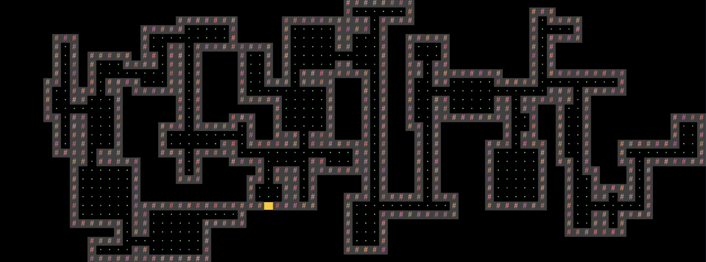
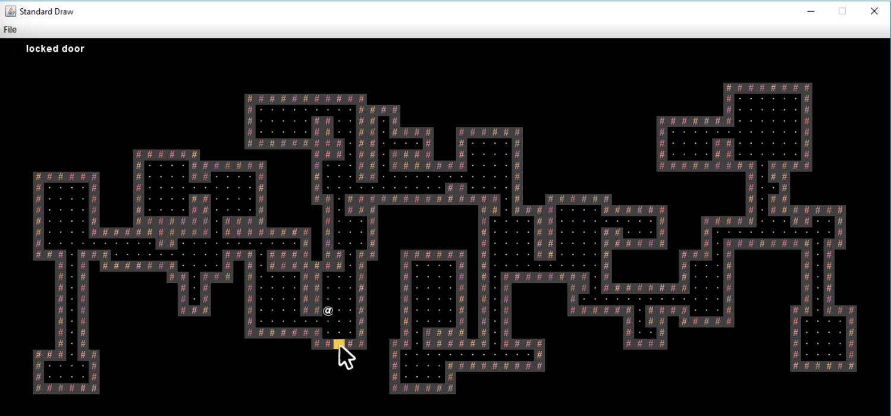

# CS61BYoW

## Phase 1: World Generation

### Skelenton Code Structor

**IMPORTANT NOTE**: Do NOT change `TETile.java`’s `character` field or `character()` method as it may lead to bad autograder results.

**IMPORTANT NOTE**: Do NOT use static variables unless they have the final keyword! Additionally, do not call `System.exit()` as this will cause the autograder to exit and fail.

### Requirements

- The world must be a 2D grid, drawn using our tile engine. The tile engine is described in [lab12](https://sp21.datastructur.es/materials/lab/lab12/lab12).
- The world must be pseudorandomly generated. Pseudorandomness is discussed in lab 12.
- The generated world must include distinct rooms and hallways, though it may also include outdoor spaces.
- At least some rooms should be rectangular, though you may support other shapes as well.
- Your world generator must be capable of generating hallways that include turns (or equivalently, straight hallways that intersect).
- The world should contain a ==random number of rooms and hallways.==
- The locations of the rooms and hallways should be random.
- The width and height of rooms should be random.
- Hallways should have a ==width of 1 or 2 tiles and a random length.==
- Rooms and hallways must have walls that are visually distinct from floors. Walls and floors should be visually distinct from unused spaces.
- Rooms and hallways should be connected, i.e. there should not be gaps in the floor between adjacent rooms or hallways.
- All rooms should be reachable, i.e. there should be no rooms with no way to enter
- The world should be substantially different each time, i.e. you should not have the same basic layout with easily predictable features

Example:

### The Default Tileset and Tile Rendering Engine

We have provided a small set of default tiles in `Tileset.java` and these should serve as a good example of how to create `TETile` objects. We strongly recommend adding your own tiles as well.

The tile engine also supports graphical tiles! To use graphical tiles, simply provide the filename of the tile as the fifth argument to the `TETile` constructor. Images must be 16 x 16, and should ideally be in PNG format. There is a large number of open source tilesets available online for tile based games. Feel free to use these.

Any `TETile` object you create should be given a unique character that other tiles do not use. Even if you are using your own images for rendering the tile, each `TETile` should still have its own character representation.

---

## Phase 2 Interactivity

### UI (User Interface) Appearance

After the user has entered a seed and pressed S, the world should be displayed with a user interface. The user interface of your project must include:

- A 2D grid of tiles showing the current state of the world.
- A “Heads Up Display” (HUD) that provides additional information that maybe useful to the user. At the bare minimum, this should include Text that describes the tile currently under the mouse pointer.

### UI Behavior

The user must be able to move up, left, down, and right using the W, A, S, and D keys, respectively. The avatar should not move when attempting to move into a wall and the program should not error.

In addition to movement keys, if the user enters “:Q” (note the colon), the program should quit and save. The description of the saving (and loading) function is described in the next section. **This command must immediately quit and save**, and should require no further keypresses to complete, e.g. do not ask them if they are sure before quitting. We will call this single action of quitting and saving at the same time “quit/saving”. This command is case insensitive, so “:q” should work as well. Additionally, “:” followed by any other letter should not do anything.

### Saving and Loading

When the user restarts `byow.Core.Main` and presses L, the world should be in **exactly the same state as it was before the project was terminated**.

In the case that a user attempts to load but there is no previous save, your system should simply quit and the UI interface should close with no errors produced.

In the base requirements, the command “:Q” should save and completely terminate the program. This means an input string that contains “:Q” should not have any more characters after it and loading a world would require the program to be run again with an input string starting with “L”.

### Interacting With Input Strings and Phase 2

You do not need to worry about replay strings that contain multiple saves, i.e. "`N5SDD:QD:QDD:Q`" is not considered a valid replay string, since the program should have terminated before the second :Q. You do not need to worry about invalid replay strings, i.e. you can assume that every replay string provided by the autograder starts with either `"N#S"` or `"L"`, where # represents the user entered seed.

The return value of the `interactWithInputString` method should not depend on whether the input string ends with `:Q` or not. The only difference is whether the world state is saved or not as a side effect of the method.

