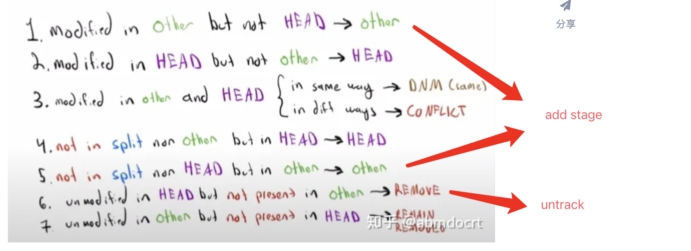

# Gitlet Spec Digest

## Overview of Gitlet

- Note that in Gitlet, there is no way to be in a detached head state since there is no `checkout` command that will move the HEAD pointer to a specific commit. The `reset` command will do that, though it also moves the branch pointer. Thus, in Gitlet, you will never be in a detached HEAD state.
- commit trees are *immutable*: once a commit node has been created, it can never be destroyed (or changed at all). We can only add new things to the commit tree, not modify existing things. This is an important feature of Gitlet! One of Gitlet’s goals is to allow us to save things so we don’t delete them accidentally.

---

## Internal Structures

1. Real Git distinguishes several different kinds of *objects*. For our purposes, the important ones are
    - **blobs**: The saved contents of files. Since Gitlet saves many versions of files, a single file might correspond to multiple blobs: each being tracked in a different commit.
    - **trees**: Directory structures mapping names to references to blobs and other trees (subdirectories).
    - **commits**: Combinations of log messages, other metadata (commit date, author, etc.), a reference to a tree, and references to parent commits. The repository also maintains a mapping from *branch heads* to references to commits, so that certain important commits have symbolic names.
2. Gitlet simplifies from Git still further by
    - Incorporating trees into commits and not dealing with subdirectories (so there will be one “flat” directory of plain files for each repository).
    - Limiting ourselves to merges that reference two parents (in real Git, there can be any number of parents.)
    - Having our **metadata** consist only of a timestamp and log message. A commit, therefore, will consist of a log message, timestamp, a mapping of file names to blob references, a parent reference, and (for merges) a second parent reference.
3. Every obj (blob) has a unique interger id hat serves as a reference to the object.
    - these ids are *universal*:
    - The objects in a repository are thus said to be *content addressable*.
    - Both Git and Gitlet accomplish this the same way: by using a *cryptographic hash function* called SHA-1 (Secure Hash 1), which produces a 160-bit integer hash from any sequence of bytes.
4. Fortunately, there are library classes for computing SHA-1 values. All you have to do is to make sure that you correctly label all your objects. In particular, this involves
    - Including all metadata and references when hashing a commit.
    - Distinguishing somehow between hashes for commits and hashes for blobs. A good way of doing this involves a well-thought out directory structure within the `.gitlet` directory. Another way to do so is to hash in an extra word for each object that has one value for blobs and another for commits.
5. the SHA-1 hash value, rendered as a 40-character hexadecimal string, makes a convenient file name for storing your data in your `.gitlet` directory (more on that below). It also gives you a convenient way to compare two files (blobs) to see if they have the same contents: if their SHA-1s are the same, we simply assume the files are the same

> 
>
> - The commits contain the file names and references to these blobs, as well as a parent link.
> - These references, depicted as arrows, are represented in the `.gitlet` directory using their SHA-1 hash values (the small hexadecimal numerals above the commits and below the blobs). 

---

## Detailed Spec of Behavior

> - The only structure requirement we’re giving you is that you have a class named `gitlet.Main`
> - don’t use any external code (aside from JUnit), and don’t use any programming language other than Java. You can use all of the Java Standard Library that you wish, plus utilities we provide.
> - **You should not do everything in the Main class.** Your Main class should mostly be calling helper methods in the the `Repository` class. 

1. The files that *aren’t* in your `.gitlet` directory (which are copies of files from the repository that you are using and editing, as well as files you plan to add to the repository) are referred to as the files in your *working directory*.
2. Most commands have runtime or memory usage requirements. Some of the runtimes are described as constant “relative to any significant measure”.
    - The significant measures are: any measure of number or size of files, any measure of number of commits. 
    - You can ignore time required to serialize or deserialize, *with the one caveat that your serialization time cannot depend in any way on the total size of files that have been added, committed, etc* 
    - You can also pretend that getting from a hash table is constant time.
3. For error msgs:
    - All error message end with a period; since our autograding is literal, be sure to include it.
    - If your program ever encounters one of these failure cases, it must print the error message and not change anything else. 
4. There are some failure cases you need to handle that don’t apply to a particular command. Here they are:
    - If a user doesn’t input any arguments, print the message `Please enter a command.` and exit.
    - If a user inputs a command that doesn’t exist, print the message `No command with that name exists.` and exit.
    - If a user inputs a command with the wrong number or format of operands, print the message `Incorrect operands.` and exit.
    - If a user inputs a command that requires being in an initialized Gitlet working directory (i.e., one containing a `.gitlet` subdirectory), but is not in such a directory, print the message `Not in an initialized Gitlet directory.`
5. Do **NOT** print out anything except for what the spec says. Some of our autograder tests will break if you print anything more than necessary.
6. To exit your program immediately, you may call `System.exit(0)`. For example, if an error occurs in the middle of a helper function and you want gitlet to terminate immediately, you would call this function. **Note: You should always supply the argument 0** to the `System.exit(0)`command. In 61C, you will learn what the argument (known as an error code) means.
7. Dangerous commands are ones that potentially overwrite files (that aren’t just metadata)–for example, if a user tells Gitlet to restore files to older versions, Gitlet may overwrite the current versions of the files.

---

## The Commands

### branch

- A branch is nothing more than a name for a reference (a SHA-1 identifier) to a commit node.

### merge

