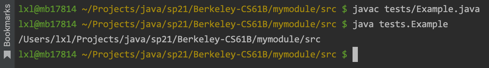
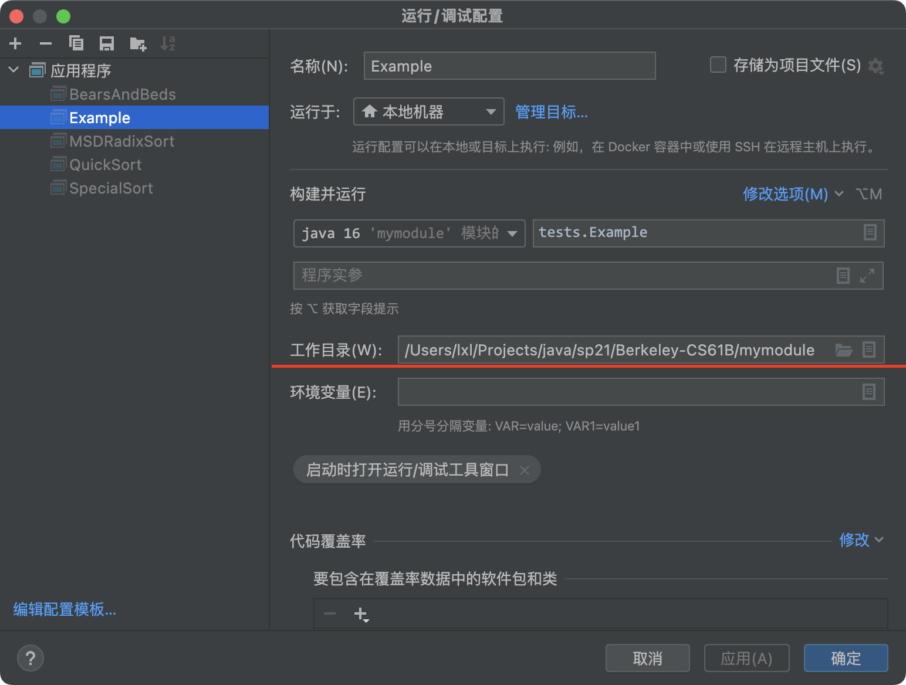

# Lab 6: Getting Started on Project 2

## Persistence

Git is somehow exhibiting **persistence**.

important notes:

- Static variables do NOT persist in Java between executions.
- When a program completes execution, all instance and static variables are completely lost. 
- The only way we can maintain persistence between executions is to store data on the file system.

---


## Java and Compilation

The Java implementations we use compile Java *source code*, written by the programmer in a `.java` file, into Java `.class` files containing *Java byte code*, which may then be executed by a separate program. Often, this separate program, called `java`, does a mix of interpreting the class file and compiling it into machine code and then having the bare hardware execute it.

do
```shell
$ java *.java
$ cat Main.class
```

- Run `ls`, and you’ll see a bunch of new `.class` files, including `Main.class`. These files constitute the *compiled code*. Let’s see what it looks like.
- That command will print out the contents of the file. You’ll see mostly garbage with many special characters. This is called *bytecode*, and even though it looks foreign to us, the `java` program can take this compiled code and actually interpret it to run the program.

To run the Main, we should
```shell
$ cd ..
$ java cpaer.Main
```

---


## Make

there are two things that you can use `make` for:

1. Compiling your code by using the `make` command.
2. Running the test suite by using `make check` command.

### make

When run `make`: it will compile all of the `.java` files in your project directory and place the `.class` files in the project folder (in our case, the `capers` folder). The output will look something like:

```
"/Library/Developer/CommandLineTools/usr/bin/make" -C capers default
javac -g -Xlint:unchecked -Xlint:deprecation -cp "..::;..;" CapersRepository.java Dog.java Main.java Utils.java
touch sentinel
```

### make check

To run the test suite, enter:

```
$ make check
```

`make check` launches our tests and prints out which ones you passed and which ones you did not.

### make clean

There is also a thread way to use `make`. Specifically `make clean` will remove all the `.class` files and other clutter if it bothers you having so many files in your project folder. 

> Terminology note: `check` and `clean` are known as *make targets*. You can actually define more targets for `make` by creating a custom `Makefile`.

---


## Files and Directories in Java

### Current Working Directory

The [current working directory](https://en.wikipedia.org/wiki/Working_directory) (CWD) of a Java program is the directory from where you execute that Java program. 

You can access the CWD from within a Java program by using `System.getProperty("user.dir")`.

> Example:
> ```java
> package tests;
> 
> public class Example {
>     public static void main(String[] args) {
>         System.out.println(System.getProperty("user.dir"));
>     }
> }
> 
> ```
>
> 

In IntelliJ, the CWD is given by the specified directory under Run > Edit Configurations > Working Directory:



**Terminal** In terminal / Git Bash, the command `pwd` will give you the CWD.

### Absolute and Relative Paths

...

### File & Directory Manipulation in Java

The Java [File](https://docs.oracle.com/javase/7/docs/api/java/io/File.html) class represents a file or directory in your operating system and allows you to do operations on those files and directories. 

#### Files

```java
File f = new File("testfiles/dummy.txt");
// The above path is a relative path where we are referring to the file dummy.txt in our Java program’s CWD.

// check if the file “dummy.txt” already exists or not with the `exists()` method of the File class
if (!f.exists()) {
    f.createNewFile();  // actually create this dummy.txt file
}

// to write a String to a file, you can do the following:
Utils.writeContents(f, "Hello World");
```

#### Directories

Directories in Java are alse represented with with File objects. 
```java
// you can make a File object that represents a directory:
File d = new File("dummy");

// Similar to files, this directory might not actually exist in your file system.
// To actually create the folder in your file system, you can run:
d.mkdir();  // and now there should be a folder called dummy in your CWD.
```

You should also checkout the `mkdirs()` method, whose documentation can be found [here](https://docs.oracle.com/javase/7/docs/api/java/io/File.html).

| `boolean` | `mkdir()` Creates the directory named by this abstract pathname. |
| --------- | ------------------------------------------------------------ |
| `boolean` | `mkdirs()` Creates the directory named by this abstract pathname, including any necessary but nonexistent parent directories. |

---


## Serializable

To enable this feature for a given class in Java, this simply involves implementing the `java.io.Serializable` interface:

```java
import java.io.Serializable;

public class Model implements Serializable {
    ...
}
```

This interface has no methods; it simply marks its subtypes for the benefit of some special Java classes for performing I/O on objects. 

See this [demo](../../mymodule/src/tests/ExampleLab6.java).

---


## Testing

Here is what the `test02-two-part-story.in` looks like:

```
# Two uses of the `story` command
> story "Hello"
Hello
<<<
> story "World"
Hello
World
<<<
```

The first line is a comment telling us what the test does. If you’re failing a test, you should read the top line to get a sense of what the test is doing.

The next 3 lines make up a section corresponding to a single execution to the program:

```
> [args given to capersMain.main()]
[first line of expected output]
[second line of expected output]
[...]
<<<
```

So we see that all of the text on the same line as the `>` corresponds to the command given to `capers.Main.main()`, and the next lines up until the `<<<` are the expected output.

> We call these *integration tests*. As opposed to *unit tests*, integration tests test many things in cohesion. A (good) unit test will only test one specific portion of your program: in our integration tests, we test multiple things. 

---


## Debugging


